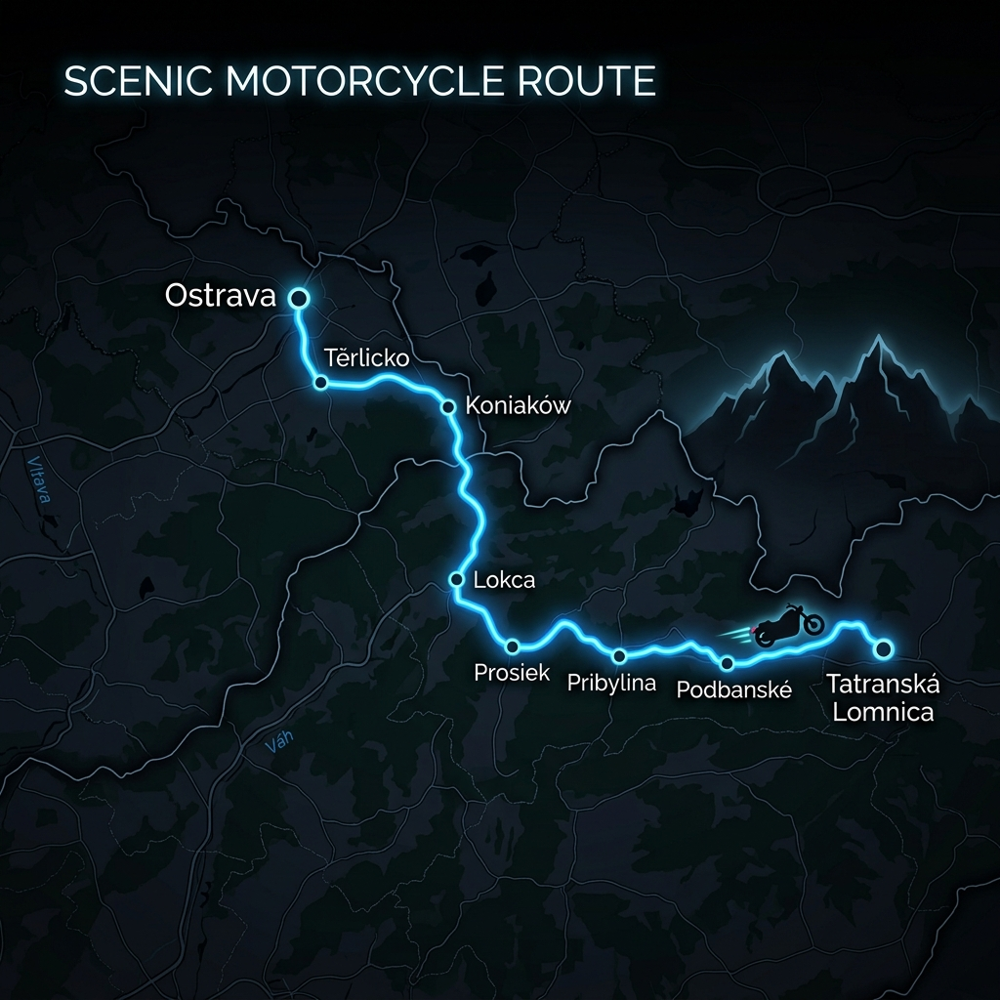

# Motovýlet Ostrava ➔ Vysoké Tatry
## Harley-Davidson Sportster Edition

Tento itinerář vás zavede z Ostravy přes polské Beskydy, slovenskou Oravu a Liptov až přímo pod štíty Vysokých Tater do Tatranské Lomnice. Trasa kombinuje technické horské zatáčky s rychlými a vyhlídkovými úseky s výborným asfaltem.

*   **Celková délka trasy:** cca 240 km.
*   **Čistý čas jízdy:** cca 4,5 hodiny pohodovým cruiser tempem.
*   **Cílový bod:** Penzion Bělín, Tatranská Lomnica.

---

## 🗺️ Odkaz na kompletní trasu

📍 **[Otevřít kompletní trasu v Google Maps](https://www.google.com/maps/dir/Vrchlick%C3%A9ho+420%2F44,+Radvanice,+716+00+Ostrava-Radvanice+a+Bartovice,+%C4%8Cesk%C3%A1+republika/T%C4%9Brlicko,+735+42+T%C4%9Brlicko/49.579587,18.7662682/Koniak%C3%B3w,+Poland/Lokca,+029+51,+Slovakia/Z%C3%A1diel,+032+23+Prosiek,+Slovakia/Pribylina,+032+42,+Slovakia/Podbansk%C3%A9,+Pribylina,+Slovakia/Pension+B%C4%9Bl%C3%ADn,+Tatransk%C3%A1+Lomnica+50,+059+60+Vysok%C3%A9+Tatry,+Slovakia/)**

---

## 📱 Navigace pro Waze (postupné úseky)

*Waze nepodporuje import celé trasy s mnoha průjezdními body najednou. Zde jsou odkazy na jednotlivé úseky, které stačí postupně rozkliknout na mobilu:*

1.  **[1. úsek: Ostrava ➔ Těrlicko ➔ Koniaków (PL)](https://waze.com/ul?ll=49.550411,18.948983&navigate=yes)**
2.  **[2. úsek: Koniaków ➔ Lokca (SK)](https://waze.com/ul?ll=49.367641,19.411934&navigate=yes)**
3.  **[3. úsek: Lokca ➔ Prosiek](https://waze.com/ul?ll=49.129678,19.501112&navigate=yes)**
4.  **[4. úsek: Prosiek ➔ Tatranská Lomnica (Penzion Bělín)](https://waze.com/ul?ll=49.167847,20.278076&navigate=yes)**

---

## 🏍️ Průjezdní body a zajímavosti na trase

### 1. Ostrava-Radvanice ➔ Těrlicko ➔ Koniaków (Polsko)
*   **Těrlicko:** První zastávka u Těrlické přehrady. Ideální na lehké ranní rozježdění.
*   **Mosty u Jablunkova ➔ polské hranice (Jasnowice):** Plynulý přejezd do polského Slezského Beskydu.
*   **Koniaków:** Nejvýše položená obec v této oblasti, známá po celém světě tradiční ruční výrobou krajek. Silnice č. 943 se zde vlní po hřebenech hor a nabízí úchvatné výhledy do krajiny a parádní zatáčky s dobrým asfaltem.
*   *💡 Tip na pauzu:* Zastavte se na vyhlídce na hřebeni a dejte si kávu v Koniakowě s výhledem na Beskydy.

### 2. Koniaków ➔ Zwardoň ➔ Lokca (Orava)
*   **Přejezd do Oravy:** Z Polska přejedete zpět na Slovensko přes hraniční průsmyk Zwardoň/Skalité a zamíříte směrem na Námestovo a Lokcu.
*   Cesta údolím řeky Oravy nabízí pohodové křižování krajinou s mírnými zatáčkami, kde si můžete užiz hluboký zvuk motoru Sportsteru.

### 3. Lokca ➔ Dolný Kubín ➔ Prosiek
*   Trasa vás vede přes Dolný Kubín na Liptov.
*   **Prosiek:** Obec ležící přímo na úpatí Chočských vrchů na severním břehu Liptovské Mary. Hned vedle se nachází známá Prosiecká dolina. Zde se nabízí skvělé místo na oběd s výhledem na jezero.

### 4. Prosiek ➔ Pribylina ➔ Podbanské ➔ Tatranská Lomnica
*   **Pribylina:** Můžete zde navštívit Muzeum liptovské dědiny (skanzen s historickými dřevěnicemi).
*   **Podbanské & Cesta Slobody (silnice č. 537):** **Zlatý hřeb celého výletu.** Silnice podél celého hřebene Vysokých Tater má nově zrekonstruovaný, dokonale hladký asfalt. Winding serpentiny mezi Podbanským a Starým Smokovcem nabízí jedinečný zážitek s výhledem na dominantní štít Kriváň.
*   **Tatranská Lomnica (Penzion Bělín):** Cílový bod výletu. Lomnica je jedno z hlavních center Tater s mnoha restauracemi a možností vyjet lanovkou na Lomnický štít.

---

## 🛠️ Praktické tipy na cestu

*   **Mýto:** Motorky jsou na Slovensku na dálnicích a rychlostních silnicích **osvobozeny od dálniční známky**. Polské rychlostní silnice a okresky jsou pro motorky také bez poplatku.
*   **Nádrž u Sportsteru:** V horských pasážích mezi Koniakowem a Oravou jsou čerpací stanice dál od sebe. Doporučujeme natankovat plnou v Těrlicku/Jablunkově a pak v Lokci/Dolném Kubíně.
*   **Počasí v Tatrách:** V horském sedle Podbanské (~950 m n. m.) a v Tatranská Lomnici může být výrazně chladněji než v Ostrava-Radvanicích. Mějte po ruce nepromok a teplejší vrstvu pod bundu.
