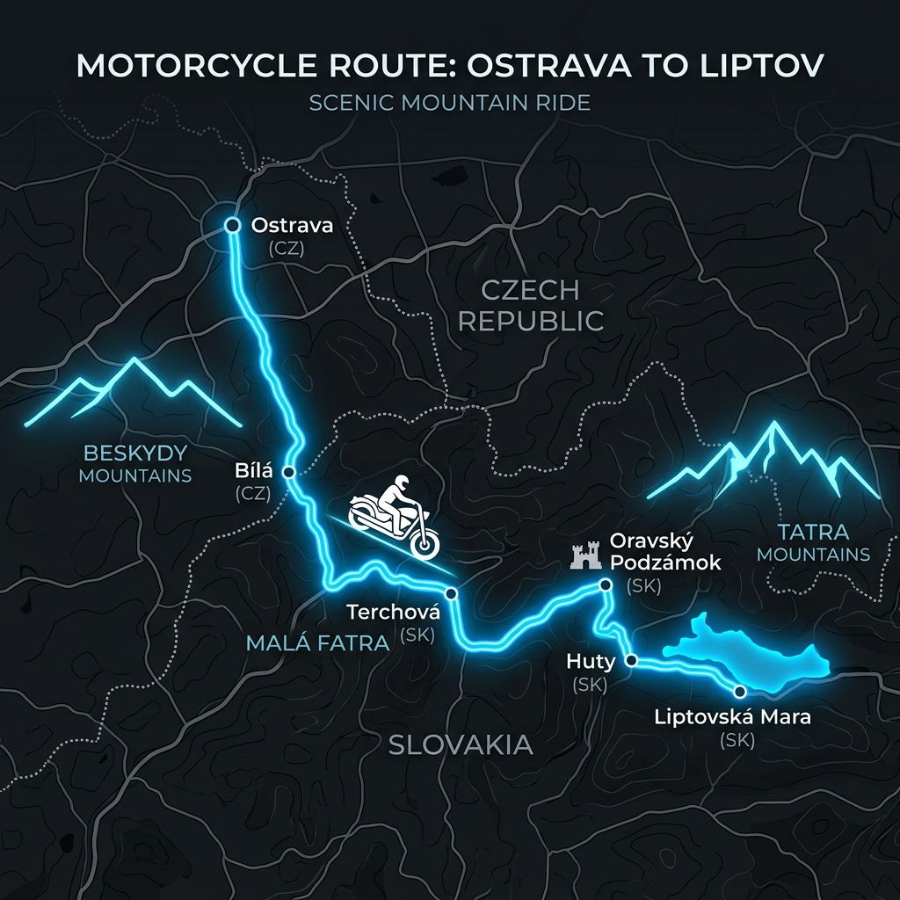

# Dvoudenní motovýlet z Ostravy na Slovensko
## Harley-Davidson Sportster Edition

📍 **[Zobrazit interaktivní trasu 1. dne na Mapy.cz](https://mapy.com/fnc/v1/route?start=18.283088,49.820923&end=19.544150,49.109880&waypoints=18.455200,49.442650;19.034780,49.258900;19.379760,49.261890;19.613385,49.259275;19.567000,49.219500&routeType=car_fast&mapset=outdoor)**

📱 **Navigace pro Waze (postupné úseky):**
*Waze bohužel neumožňuje import celé trasy s více průjezdními body přes odkaz (API Waze podporuje pouze jeden cíl). Zde jsou odkazy na jednotlivé úseky, které stačí postupně rozkliknout na mobilu:*
1. [1. úsek: Ostrava ➔ Bílá](https://waze.com/ul?ll=49.442650,18.455200&navigate=yes)
2. [2. úsek: Bílá ➔ Terchová](https://waze.com/ul?ll=49.258900,19.034780&navigate=yes)
3. [3. úsek: Terchová ➔ Oravský Podzámok](https://waze.com/ul?ll=49.261890,19.379760&navigate=yes)
4. [4. úsek: Oravský Podzámok ➔ horský přechod Huty](https://waze.com/ul?ll=49.219500,19.567000&navigate=yes)
5. [5. úsek: Huty ➔ Liptovská Mara](https://waze.com/ul?ll=49.109880,19.544150&navigate=yes)

Tento itinerář je navržen speciálně pro motocykly typu cruiser / chopper (jako je **Harley-Davidson Sportster**). Respektuje specifika těchto strojů:
*   **Žádné dálniční přesuny:** Sportster si nejvíce užijete na kvalitních okreskách s krásnými zatáčkami, kde vynikne jeho charakter, zátah odspodu a bublající motor.
*   **Kvalitní asfalt:** Vzhledem k tvrdšímu zadnímu odpružení a nižším zdvihům Sportsteru trasa preferuje cesty s převážně dobrým a nedávno renovovaným povrchem.
*   **Rozumný denní nájezd:** Kolem **220–250 km denně**. To představuje cca 4 až 5 hodin čisté jízdy a zanechává dostatek času na focení, kávu, obědy a relaxaci.
*   **Scénické horské průsmyky:** Legendární slovenské přechody jako **Huty** nebo **Fačkovské sedlo**.

---

## 🗺️ Přehled trasy

| Den | Hlavní trasa | Vzdálenost | Hlavní lákadla |
|:---|:---|:---|:---|
| **1. Den** | Ostrava ➔ Bílá ➔ Terchová ➔ Oravský Podzámok ➔ horský přechod Huty ➔ Liptovská Mara | cca 240 km | Údolí Ostravice, Malá Fatra, Oravský hrad, zatáčky Huty, ubytování u přehrady |
| **2. Den (A)** | Liptovská Mara ➔ Martin ➔ Fačkovské sedlo ➔ Čičmany ➔ Rajecké Teplice ➔ Ostrava | cca 245 km | Údolí Váhu, nově vyasfaltované Fačkovské sedlo, rázovitá obec Čičmany, lázeňská káva |
| **2. Den (B)** | Liptovská Mara ➔ Zázrivá ➔ Oravská Lesná ➔ Vychylovka (II/520) ➔ Stará Bystrica ➔ Ostrava | cca 210 km | Lesní spojka Orava-Kysuce s dokonalým asfaltem, Slovenský orloj, návrat přes Jablunkov |

---

## 🏍️ 1. Den: Z Ostravy do srdce Liptova (240 km)

První den vás provede beskydskou motorkářskou klasickou, protáhne vás skrze národní park Malá Fatra a zakončíte ho jedním z nejkrásnějších horských přechodů na Slovensku.

### Itinerář krok za krokem:
1.  **Ostrava ➔ Frýdek-Místek ➔ Ostravice ➔ Bílá (silnice 56):** 
    *   *Charakter:* Legendární český motorkářský úsek. Široké, přehledné zatáčky v lesním údolí s perfektním asfaltem. Ideální na zahřátí gum.
2.  **Bílá ➔ Bumbálka (státní hranice) ➔ Makov ➔ Bytča:** 
    *   *Charakter:* Průjezd přes Beskydy na Slovensko. Klesání z Bumbálky směrem na Makov nabízí pěkné zatáčky (pozor na kamiony). Z Makova pokračujete klidným tempem údolím až do Bytče.
3.  **Bytča ➔ Žilina ➔ Terchová (silnice 583):** 
    *   *Charakter:* Objezd Žiliny a vjezd do oblasti Malé Fatry. Průjezd kolem skalních soutěsek v Terchové (rodiště Juraje Jánošíka) je velmi scénický.
    *   *💡 Tip na oběd:* Zastavte se na tradiční halušky přímo v Terchové nebo v nedaleké Zázrivé.
4.  **Terchová ➔ Zázrivá ➔ Párnica ➔ Oravský Podzámok:** 
    *   *Charakter:* Zvlněná krajina s pěknými výhledy a dobrým asfaltem. 
    *   *📷 Foto-stop:* V Oravském Podzámku zaparkujte pod majestátním **Oravským hradem**, který se tyčí na vysoké skále přímo nad silnicí.
5.  **Oravský Podzámok ➔ Tvrdošín ➔ Podbiel ➔ Zuberec:** 
    *   *Charakter:* Rychlejší přesun směr Západní Tatry (Roháče). Cesta začíná stoupat a otevírají se výhledy na horské štíty.
6.  **Zuberec ➔ Horský přechod Huty ➔ Liptovská Mara (silnice 584):** 
    *   *Charakter:* **Zlatý hřeb dne.** Horský přechod Huty spojuje Oravu a Liptov. Na silnici je položen speciální červený protiskluzový asfalt s vysokou přilnavostí. Čekají vás ostré vracečky, strmé stoupání a na vrcholu panoramatický výhled na celou Liptovskou kotlinu a jezero Liptovská Mara.
    *   *Ubytování:* Doporučujeme najít penzion nebo chatku v okolí Liptovské Mary (např. Liptovský Trnovec) či přímo v Liptovském Mikuláši. Večerní posezení u vody pod Tatrami má skvělou atmosféru.

---

## 🏍️ 2. Den: Návrat domů (Výběr ze dvou variant)

Pro návrat do Ostravy máte na výběr dvě skvělé trasy podle toho, zda chcete raději zatáčky a kulturu, nebo klidnou jízdu hlubokými lesy.

### 🌟 Varianta A: Zatáčky, malované chalupy a lázně (245 km)
*Tato varianta je pestrá, nabízí parádní zatáčky na Fačkovském sedle a zajímavé zastávky.*

1.  **Liptovská Mara ➔ Ružomberok ➔ Martin:**
    *   Průjezd údolím řeky Váh (Kraľovanský kaňon). Pozor, kvůli rozestavěné dálnici zde bývá hustší provoz.
2.  **Martin ➔ Turčianske Teplice ➔ Kľačno ➔ Fačkovské sedlo (silnice I/64):**
    *   *Charakter:* Cesta vede Turčianskou kotlinou s výhledy na Malou Fatru. Následuje výjezd na **Fačkovské sedlo**.
    *   *Stav cesty:* **Skvělá zpráva!** Koncem roku 2025 dostal tento horský úsek zcela nový asfaltový koberec, takže dřívější "tankodrom" je minulostí. Zatáčky jsou zde utažené a velmi zábavné.
3.  **Čičmany (odbočka pod Fačkovským sedlem):**
    *   *Charakter:* Unikátní památková rezervace lidové architektury. Dřevěnice jsou zde zdobeny typickými bílými geometrickými vzory.
    *   *💡 Tip:* Ideální místo pro klidnou procházku a oběd.
4.  **Čičmany ➔ Rajec ➔ Rajecké Teplice:**
    *   *Charakter:* Průjezd malebnou Rajeckou dolinou. V Rajeckých Teplicích (známé lázeňské městečko) doporučujeme zastavit v parku na odpolední kávu.
5.  **Rajecké Teplice ➔ Žilina ➔ Čadca ➔ Jablunkovský průsmyk ➔ Ostrava:**
    *   *Charakter:* Návrat do ČR. Úsek Žilina – Čadca bývá frekventovaný, ale od Čadce se napojíte na rychlou, přehlednou čtyřproudovou silnici přes Jablunkov, která vás pohodlným cruiser tempem dovede zpět do Ostravy.

---

### 🌲 Varianta B: Kysucko-oravská lesní magistrála (210 km)
*Kratší, klidnější trasa s minimem provozu, která vede přes nově vybudovanou horskou silnici v lesích.*

📍 **[Zobrazit interaktivní trasu 2. dne (Varianta B) na Mapy.cz](https://mapy.com/fnc/v1/route?start=19.544150,49.109880&end=18.283088,49.820923&waypoints=19.155800,49.273600;19.182400,49.369700;19.100900,49.382600;18.940300,49.346800&routeType=car_fast&mapset=outdoor)**

📱 **Navigace pro Waze (postupné úseky):**
1. [1. úsek: Liptovská Mara ➔ Zázrivá](https://waze.com/ul?ll=49.273600,19.155800&navigate=yes)
2. [2. úsek: Zázrivá ➔ Oravská Lesná](https://waze.com/ul?ll=49.369700,19.182400&navigate=yes)
3. [3. úsek: Oravská Lesná ➔ Stará Bystrica (přes Vychylovku)](https://waze.com/ul?ll=49.346800,18.940300&navigate=yes)
4. [4. úsek: Stará Bystrica ➔ Ostrava](https://waze.com/ul?ll=49.820923,18.283088&navigate=yes)

1.  **Liptovská Mara ➔ Ružomberok ➔ Dolný Kubín ➔ Párnica ➔ Zázrivá:**
    *   Návrat severní trasou podél hor. Úsek Zázrivá – Oravská Lesná nabízí klidnou silnici s minimem aut.
2.  **Oravská Lesná ➔ Vychylovka (silnice II/520):**
    *   *Charakter:* Novější silniční spojka mezi Oravou a Kysucemi. Silnice stoupá hustými lesy a nabízí fantastický hladký asfalt, táhlé přehledné zatáčky a téměř nulový provoz. Pro Sportstera je to vyloženě "kochačka".
3.  **Stará Bystrica:**
    *   *📷 Zastávka:* Na náměstí se nachází **Slovenský orloj** – jeden z nejmladších a nejkrásnějších dřevěných orlojů na světě.
4.  **Stará Bystrica ➔ Čadca ➔ Jablunkov ➔ Ostrava:**
    *   Návrat přes Kysuckou vrchovinu a Jablunkovský průsmyk zpět domů.

---

## 🛠️ Praktické tipy pro cestu na Slovensko

> [!NOTE]
> **Dálniční známka na Slovensku:** 
> Motocykly jsou na Slovensku (i v ČR) **zcela osvobozeny od dálničních poplatků**. Pokud se tedy omylem nebo kvůli zrychlení ocitnete na dálnici (např. obchvat Žiliny nebo úsek Ivachnová–Liptovský Mikuláš), nemusíte nic platit ani nikde registrovat SPZ.

> [!WARNING]
> **Rychlostní limity a policie:**
> Na horském přechodu Huty platí na mnoha úsecích omezení na **60 km/h** a slovenští policisté zde o víkendech rádi měří rychlost. Měření bývá časté i v obcích v Rajecké dolině.

*   **Příprava Sportsteru na hory:**
    *   Silnice Huty i Fačkovské sedlo stoupají do výšek kolem 800–900 m n. m. Teploty nahoře mohou být o 5–8 °C nižší než v údolí. Přibalte si pod koženou bundu větrovku nebo teplou mezivrstvu.
    *   Vzhledem k menší nádrži u některých modelů Sportster (zejména u verzí s "peanut" nádrží na 7,9 l / 12,5 l) doporučujeme tankovat při každé příležitosti – v horských oblastech Oravy a Kysuc jsou rozestupy mezi benzínkami větší. Benzínky jsou bez problému v Bytči, Terchové, Dolném Kubíně, Zuberci a Liptovském Mikuláši.

---

## 🏕️ Nejlevnější ubytování pro 3 motorkáře (Liptov)

Pro tři lidi na motorkách potřebujete ideálně dvě věci: **nízkou cenu** a **bezpečné parkování pro 3 motorky** (mimo dosah veřejné ulice). Zde jsou nejlepší rozpočtové varianty v okolí Liptovské Mary:

### 1. Mara Camping (Liptovský Trnovec) - Nejlevnější varianta u vody
*   **Vlastní stany (nejlevnější vůbec):** Cca **8–10 € / osoba / noc** + **4–5 € / motorka**. Pro 3 lidi se 3 stany a motorkami vyjde noc celkem na cca **40–45 €**.
*   **Dřevěné chatky (Klasik / Tatranec):** Pokud nechcete vozit stany na Sportsteru (kde je málo místa na zavazadla), můžete si pronajmout 3 až 4lůžkovou chatku. Cena se dělí třemi, takže vychází na cca **20–30 € / osoba / noc**. Výhodou je, že motorky parkujete přímo vedle chatky a spíte v posteli.

### 2. Soukromé "Priváty" s uzavřeným dvorem - Nejlepší poměr cena/bezpečí
Na Liptově je obrovské množství ubytování v somkromí (tzv. *priváty*), které nabízejí pronájem pokojů v rodinných domech s oplocenou zahradou. Ceny za třílůžkový pokoj se pohybují kolem **15–25 € / osoba / noc**.
*   **Privát Dolina (Demänová):** Nabízí bezplatné parkování přímo v oploceném areálu privátu. Demänová je hned vedle Liptovského Mikuláše a je skvělým výchozím bodem.
*   **Privát Mako (Trstené):** Ubytování v samostatném objektu v uzavřeném dvoře s velkým pozemkem (1000 m²), kde jsou vaše stroje v naprostém bezpečí.
*   **Penzion Alenka (Demänová):** Rovněž vyhledávaný penzion s vlastním oploceným parkovištěm a rozumnými cenami.

> [!TIP]
> Při rezervaci přes portály (např. MegaUbytovanie.sk nebo Booking.com) vždy napište majiteli dotaz: *"Máte možnost bezplatného parkování 3 motocyklů v uzavřeném dvoře nebo garáži?"* Většina privátů na Liptově vám vyhoví a nechá vás zaparkovat za bránou na zahradě.
