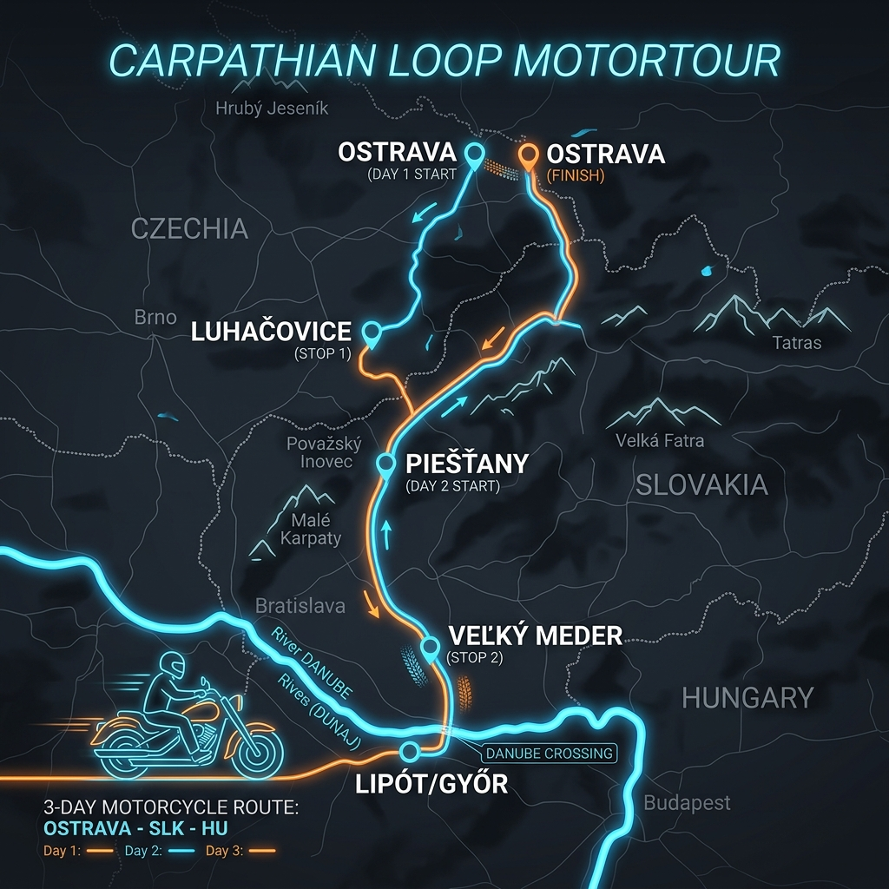

# Třídenní motovýlet Slovensko & Maďarsko
## Harley-Davidson Sportster Edition

Tento třídenní itinerář je navržen pro pohodové ježdění na motocyklu **Harley-Davidson Sportster**. Vyhýbá se nudným dálnicím, vybírá cesty s dobrým asfaltem a kombinuje jízdu v zatáčkách s relaxací v termálních lázních na Slovensku a v Maďarsku.

*   **Celková délka trasy:** cca 660 km (rozložených do 3 dnů).
*   **Hlavní základna (ubytování na obě noci):** **Veľký Meder** (jižní Slovensko). Ubytování zde slouží jako skvělý výchozí bod. Můžete zde nechat těžká zavazadla a druhý den jet do Maďarska "nalehko".

---

## 🗺️ Přehled trasy

| Den | Trasa | Vzdálenost | Hlavní lákadla |
|:---|:---|:---|:---|
| **1. Den** | Ostrava ➔ Luhačovice ➔ Piešťany ➔ Veľký Meder | cca 280 km | Průsmyk Dušná, lázně Luhačovice, kopce Bílých Karpat, koupání ve Veľkém Mederu |
| **2. Den** | Veľký Meder ➔ Lipót (HU) ➔ Győr (HU) ➔ Veľký Meder | cca 90 km | Přejezd Dunaje, termální park v přírodě Lipót, barokní centrum Győru |
| **3. Den** | Veľký Meder ➔ Trenčín ➔ Bytča ➔ Makov ➔ Bílá ➔ Ostrava | cca 260 km | Hrad Beckov/Trenčín, údolí Váhu, horský přejezd Makov, zatáčky a údolí Bílé |

---

## 🏍️ 1. Den: Z Ostravy na jižní Slovensko (280 km)
*První den vás provede Beskydami, krásnými zatáčkami Bílých Karpat a zakončíte ho relaxací v termálním koupališti.*

📍 **[Zobrazit trasu 1. dne na Mapy.cz](https://mapy.com/fnc/v1/route?start=18.283088,49.820923&end=17.768100,47.854900&waypoints=17.996100,49.400500;17.757800,49.099800;17.701100,48.902900;17.828500,48.590800&routeType=car_fast&mapset=outdoor)**

📱 **Navigace pro Waze (postupné úseky):**
1. [1. úsek: Ostrava ➔ Luhačovice (přes průsmyk Dušná)](https://waze.com/ul?ll=49.099800,17.757800&navigate=yes)
2. [2. úsek: Luhačovice ➔ Piešťany (přes Strání)](https://waze.com/ul?ll=48.590800,17.828500&navigate=yes)
3. [3. úsek: Piešťany ➔ Veľký Meder](https://waze.com/ul?ll=47.854900,17.768100&navigate=yes)

### Popis trasy a zajímavosti:
*   **Ostrava ➔ Vsetín (přes Dušnou):** Z Ostravy vyrazte směr Valašské Meziříčí a Vsetín. Nad Vsetínem si nenechte ujít **horské sedlo Dušná** – krásné zatáčky s kvalitním asfaltem v lesním prostředí.
*   **Luhačovice (Zastávka na kávu):** Nádherné lázeňské město s jedinečnou architekturou Dušana Jurkoviče. Ideální místo na dopolední procházku po kolonádě a kávu.
*   **Průjezd Bílých Karpat (Strání ➔ Nové Mesto nad Váhom):** Hranici překročíte přes sedlo Strání. Cesta dolů na slovenskou stranu nabízí táhlé a přehledné zatáčky, které si na chopperu/cruiseru užijete.
*   **Piešťany:** Významné slovenské lázeňské město na řece Váh. Pokud máte čas, udělejte si krátkou pauzu na Lázeňském ostrově.
*   **Veľký Meder (Cíl):** Příjezd do ubytování. Večer můžete vyrazit přímo do zdejšího termálního koupaliště **Thermal Corvinus** (otevřeno celoročně, teplá termální voda, kryté i venkovní bazény).

---

## 🏍️ 2. Den: Maďarské termály a barokní Győr (90 km)
*Dnes necháte kufry na ubytování a vyrazíte na lehkou jízdu přes dunajské rameno do Maďarska. Cesta je krátká, abyste měli dostatek času na koupání a prohlídku města.*

📍 **[Zobrazit trasu 2. dne na Mapy.cz](https://mapy.com/fnc/v1/route?start=17.768100,47.854900&end=17.768100,47.854900&waypoints=17.771900,47.794400;17.471900,47.859700;17.635100,47.687500&routeType=car_fast&mapset=outdoor)**

📱 **Navigace pro Waze (postupné úseky):**
1. [1. úsek: Veľký Meder ➔ Lipót (termály Maďarsko)](https://waze.com/ul?ll=47.859700,17.471900&navigate=yes)
2. [2. úsek: Lipót ➔ Győr](https://waze.com/ul?ll=47.687500,17.635100&navigate=yes)
3. [3. úsek: Győr ➔ Veľký Meder](https://waze.com/ul?ll=47.854900,17.768100&navigate=yes)

### Popis trasy a zajímavosti:
*   **Přejezd Dunaje (Medveďov ➔ Maďarsko):** Přejedete hraniční most přes Dunaj a ocitnete se v maďarské oblasti *Szigetköz* (Meziostroví) – rovinatá krajina plná ramen Dunaje a klidných vesnických silnic.
*   **Termální lázně Lipót (Lázně v přírodě):** 
    *   *Co vás čeká:* Úžasný, rozsáhlý termální park zasazený v tiché přírodě. Nabízí bazény s teplou léčivou vodou (38 °C), masážní trysky, divokou řeku a rodinnou atmosféru. Je to mnohem klidnější místo než obří aquaparky. Strávíte zde pohodové dopoledne a oběd.
*   **Győr (Historické centrum):** Odpoledne přejedete do Győru (cca 25 km). Je to jedno z nejkrásnějších maďarských měst s bohatou barokní architekturou. Zaparkujte motorky v blízkosti historického centra, dejte si maďarský guláš a projděte se kolem soutoku řek.
*   **Návrat:** V podvečer se vrátíte zpět do Veľkého Mederu na ubytování.

---

## 🏍️ 3. Den: Zpáteční cesta přes Bytču a Bílou (260 km)
*Návratová trasa vede údolím Váhu a přes Beskydy. Užijete si horský přejezd Makov a parádní lesní zatáčky podél přehrady Šance a řeky Ostravice.*

📍 **[Zobrazit trasu 3. dne na Mapy.cz](https://mapy.com/fnc/v1/route?start=17.768100,47.854900&end=18.283088,49.820923&waypoints=18.041600,48.891100;18.558400,49.222300;18.455200,49.442650;18.454200,49.442100&routeType=car_fast&mapset=outdoor)**

📱 **Navigace pro Waze (postupné úseky):**
1. [1. úsek: Veľký Meder ➔ Bytča (přes Trenčín)](https://waze.com/ul?ll=49.222300,18.558400&navigate=yes)
2. [2. úsek: Bytča ➔ Bílá (přes horský přejezd Makov)](https://waze.com/ul?ll=49.442100,18.454200&navigate=yes)
3. [3. úsek: Bílá ➔ Ostrava](https://waze.com/ul?ll=49.820923,18.283088&navigate=yes)

### Popis trasy a zajímavosti:
*   **Veľký Meder ➔ Trenčín ➔ Bytča:** Cesta na sever údolím Váhu kolem hradu Beckov a Trenčína až do Bytče. Ideální úsek pro pohodové a plynulé cruiser tempo.
*   **Bytča ➔ Horský přejezd Makov (Bumbálka):** Z Bytče začnete stoupat do kopců. Přejezd Makova (hraniční přechod Bumbálka) je oblíbené motorkářské místo s krásnými a širokými zatáčkami a dobrým asfaltem.
*   **Makov ➔ Bílá ➔ Ostrava:** Po přejezdu hranic sjedete do obce Bílá. Následuje průjezd podél přehrady Šance a údolím Ostravice až do Ostravy. Tento závěrečný lesní úsek se zatáčkami s dokonalým asfaltem je perfektní tečkou za celým výletem.

---

## 🛠️ Praktické tipy na cestu

> [!NOTE]
> **Dálniční známka na Slovensku:**
> Motocykly jsou na Slovensku i v Maďarsku **osvobozeny od dálničních poplatků** (v Maďarsku platí motocykly známku, ale my jedeme výhradně po okreskách, takže se dálnicím vyhýbáme a nic neplatíte). Na Slovensku jsou dálnice pro motorky zdarma úplně.

> [!IMPORTANT]
> **Pojištění a doklady:**
> Nezapomeňte si vzít **Zelenou kartu** od motorky a občanský průkaz/pas (přejíždíte do Maďarska mimo Schengenské vnitrozemské kontroly, ale doklady jsou nutné). V Maďarsku platí přísná nulová tolerance alkoholu za volantem/řídítky.

---

## 🏕️ Nejlevnější ubytování pro 3 motorkáře (Liptov)

### 1. Mara Camping (Liptovský Trnovec) - Nejlevnější varianta u vody
*   **Vlastní stany:** Cca **8–10 € / osoba / noc** + **4–5 € / motorka**. Celkem pro 3 lidi za cca **40–45 €**.
*   **Dřevěné chatky (Klasik / Tatranec):** Pokud nechcete vozit stany, 3–4lůžková chatka vyjde po rozdělení na **20–30 € / osoba / noc**. Motorky parkujete hned u chatky.

### 2. Soukromé "Priváty" s uzavřeným dvorem - Nejlepší poměr cena/bezpečí
Pokoje v soukromí s oplocenou zahradou za cca **15–25 € / osoba / noc** za třílůžkový pokoj.
*   **Privát Dolina (Demänová):** Bezplatné parkování přímo v oploceném areálu.
*   **Privát Mako (Trstené):** Uzavřený dvůr s velkým pozemkem (1000 m²).
*   **Penzion Alenka (Demänová):** Oplocené parkování, velmi rozumné ceny.

> [!TIP]
> Při rezervaci přes MegaUbytovanie.sk nebo Booking.com vždy napište majiteli: *"Máte možnost bezplatného parkování 3 motocyklů v uzavřeném dvoře nebo garáži?"* Většina vyhoví.
